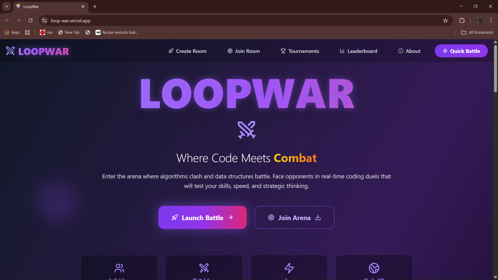
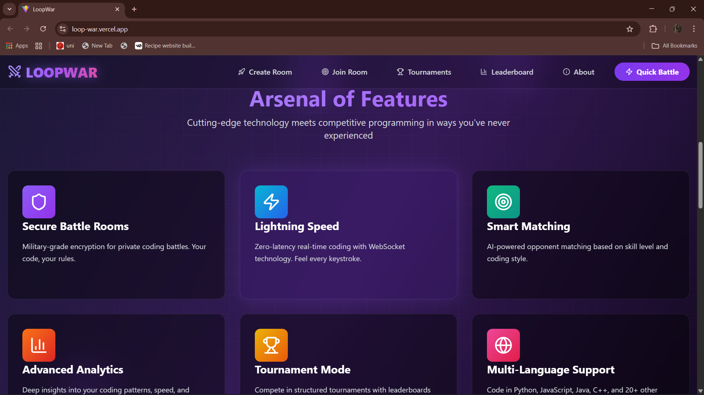
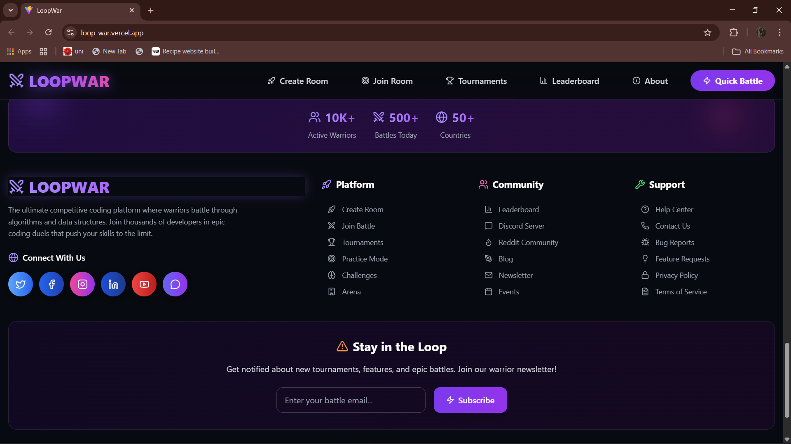

# ⚔️ Loopwar

**Loopwar** is a unique and competitive 1v1 Code Playground where developers can battle head-to-head in real-time. Whether you're a student sharpening your skills or a developer looking for an adrenaline-filled coding match — Loopwar is your arena.

---

## 📑 Table of Contents
- [🚀 What is Loopwar?](#-what-is-loopwar)
- [🎮 Key Features](#-key-features)
- [🗃️ Database Usage](#️-database-usage)
- [📌 Tech Stack](#-tech-stack)
- [🖼️ Screenshots](#️-screenshots)
- [⚙️ How to Run the Code](#️-how-to-run-the-code)
- [📂 Directory Structure](#-directory-structure)
- [💡 Future Plans](#-future-plans)
- [🙌 Acknowledgement](#-acknowledgement)
- [👤 Creator](#-creator)

---

## 🚀 What is Loopwar?

Loopwar allows users to:
- Create private/public coding battle rooms.
- Join others' rooms using a Room ID and Password.
- Compete in solving the same coding problem in real-time.
- Watch your opponent's live code updates.
- Submit solutions and track results instantly.
- Experience a fast-paced, competitive programming environment with friends or strangers.

---

## 🎮 Key Features

- 🔐 **Secure Rooms** – Create or join rooms with ID + password authentication.  
- ⏱️ **Real-Time Code Battles** – See code changes live with zero lag.  
- 👥 **1v1 Multiplayer** – Focused and intense duels with a single opponent.  
- 🧠 **Problem Sync** – Both players get the same coding problem.  
- 📊 **Live Results** – Know who solved it first, how long it took, and who won.  
- 💬 **Optional Chat Support** (Future) – Chat with opponents during or after the match.  
- 🌐 **Responsive UI** – Fully optimized for desktop and mobile.  

---

## 🗃️ Database Usage

The project uses a backend database to manage:
- 🔸 User authentication (for login/joining rooms)  
- 🔸 Room creation & room access control (ID + password)  
- 🔸 Problem assignment for each room  
- 🔸 Real-time code syncing and collaboration  
- 🔸 Submission tracking (time, status, score)  

The database is structured to handle both **real-time updates** and **persistent storage**, ensuring:
- ⚡ Fast performance during active games  
- 📜 Reliable results/history tracking post-match  

---

## 📌 Tech Stack

- **Frontend:** React / Next.js, Tailwind CSS  
- **Code Editor:** Monaco Editor or similar  
- **Backend:** Node.js, Express (or Serverless functions)  
- **Database:** Real-time + auth-supported DB (Firebase, Supabase, or MongoDB with WebSockets)  
- **Real-Time Sync:** WebSockets / Firebase Realtime Database  

---

## 🖼️ Screenshots

| Home Page | 


| Features Page| 


| Footer UI| 


---

## ⚙️ How to Run the Code

```bash
# 1️⃣ Clone the repository
git clone https://github.com/your-username/loopwar.git
cd loopwar

# 2️⃣ Install dependencies
npm install

# 3️⃣ Start the development server
npm run dev

# 4️⃣ Open in browser
http://localhost:3000


```
## 📂 Directory Structure
```
loopwar/
│
├── backend/ # Backend server code (Node.js/Express or similar)
│
├── frontend/ # Frontend (Vite + React + Tailwind CSS)
│ ├── public/ # Static assets (images, icons, etc.)
│ │ └── loopwar_logo.png
│ │
│ ├── src/ # Application source code
│ │ ├── assets/ # Project-specific assets (images, fonts, etc.)
│ │ ├── components/ # Reusable UI components
│ │ ├── css/ # Custom CSS files
│ │ ├── pages/ # Page components
│ │ ├── App.css
│ │ ├── App.jsx
│ │ ├── index.css
│ │ └── main.jsx
│ │
│ ├── .env # Environment variables
│ ├── eslint.config.js # ESLint configuration
│ ├── index.html # HTML template
│ ├── package.json # Project dependencies
│ ├── package-lock.json # Dependency lock file
│ ├── postcss.config.js # PostCSS configuration
│ ├── tailwind.config.js # Tailwind CSS configuration
│ ├── vercel.json # Vercel deployment config
│ ├── vite.config.js # Vite configuration
│ └── .gitignore
│
└── README.md # Documentation

```
---

## 💡 Future Plans
🧠 AI-generated problems

👑 Leaderboard & global ranking

📜 Room history and match replays

🧪 Practice mode & training battles

🎙️ Voice chat integration for interactive duels

---
## 🙌 Acknowledgement
Special thanks to:

OpenAI – for inspiring real-time collaborative projects

Firebase / Supabase – for making real-time data syncing easier

Developers & Testers – who contributed feedback and bug reports during development

---

## 👤 Creator
```
Dinesh Bhardwaj
💼 GitHub: https://github.com/dinesh-2047
📧 Email: dinesh07bhardwaj@gmail.com
✉️LinkedIn:https://www.linkedin.com/in/dinesh-bhardwaj2047/
```
